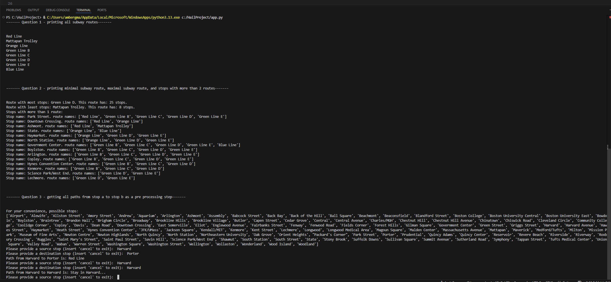

# MBTA api integration project
This repository is using MBTA API to extract and display data on subway routes in Boston.

MBTA API documentation - https://api-v3.mbta.com/docs/swagger/index.html

## Project Structure

This project contains the following modules:
1. `data_provider.py` - handles the interaction with the MBTA api, parsing the data, and returning it in abstract models
1. `paths_calculator.py` - respobsible for executing the algorithm that calculates paths from stop i to stop j
1. `user_interaction.py` - manages the interation with the user (user inserts source and destination stops, and gets a path to get from source to destination)
1. `models.py` - contracts (abstract types) for objects that this project uses (Route, Stop)
1. `app.py` - main execution module (using the above modules to manage the execution flow)
1. `tests.py` - tests for other modules

## Run the project

### Using docker

1. `docker build -t mbta-python-app .`
1. `docker run -it mbta-python-app`

### Using python:

1. `pip install requests` (install prerequisite of [requests python package](https://pypi.org/project/requests/))
1. `python app.py`

## Run the tests

### Using docker:

Just run `docker build -t mbta-python-app .`.

This is running the `tests.py` file as part of building the docker image - the build will fail if the tests are failing.

### Using python:

RUN `python tests.py`

## Displaying the results

1. When you run the application (see `Run the project` section above), the app will automatically fetch the data from MBTA API, and then:
1. It will print the list of subway routes (Red Line, Blue Line, ...)
1. Then it will print the route with the most stops, the route with the least stops, and list of stops with more than one route going through them
1. Then, it will ask you to provide a source station and destination station, and will print the path from source to destination (see example below)
1. To exit, insert `cancel` in the console.

### Execution example: 

